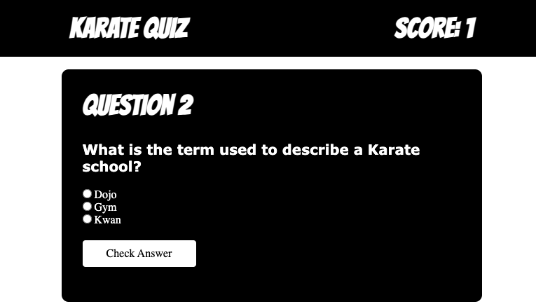

## Inleiding

In dit project ga je een webapp maken waarmee de gebruiker kan laten zien wat hij of zij weet over een onderwerp dat jij kiest! Je zou een quiz kunnen maken over geschiedenis, natuur, wereldrecords, wetenschap, sport, mode, TV, films, of iets anders waar je een expert in bent!

Het internet heeft ons geholpen om **kennis te delen** en ideeën met mensen over de hele wereld. Het delen van kennis helpt ons andere gemeenschappen en culturen te begrijpen en herinnert ons eraan dat we allemaal van elkaar kunnen leren.

Je gaat:

- Een onderwerp kiezen en vragen maken
- Knoppen, CSS en JavaScript gebruiken om vragen te animeren, weergeven en verbergen
- JavaScript gebruiken om de antwoorden van de gebruiker te controleren, hun score bij te houden en een eindbericht weer te geven

--- no-print ---

--- task ---

### Probeer het uit!

Beantwoord de vragen en bekijk de animaties!

[Bekijk van binnen](https://editor.raspberrypi.org/nl-NL/projects/quiz-time-animals){:target="_blank"}

<iframe src="https://editor.raspberrypi.org/nl-NL/embed/viewer/quiz-time-animals" width="100%" height="600" frameborder="0" marginwidth="0" marginheight="0" allowfullscreen> 
</iframe>

--- /task ---

### Doe inspiratie op

Je gaat een aantal ontwerpbeslissingen nemen om je quiz te creëren!

- Waar gaat jouw quiz over?
- Hoeveel vragen wil je toevoegen?
- Hoeveel opties geef je bij elke vraag?
- Hoeveel punten krijgt de gebruiker voor het juiste antwoord?
- Welke animaties ga je op elke vraag toepassen?

--- task ---

Bekijk dit voorbeeldproject om meer ideeën op te doen:

**Karatequiz**: [Bekijk van binnen](https://editor.raspberrypi.org/nl-NL/projects/quiz-time-karate){:target="_blank"}

<iframe src="https://editor.raspberrypi.org/nl-NL/embed/viewer/quiz-time-karate" width="100%" height="600" frameborder="0" marginwidth="0" marginheight="0" allowfullscreen> 
</iframe>

--- /task ---

--- /no-print ---

--- print-only ---

### Doe inspiratie op

**Karatequiz**

--- /print-only ---

